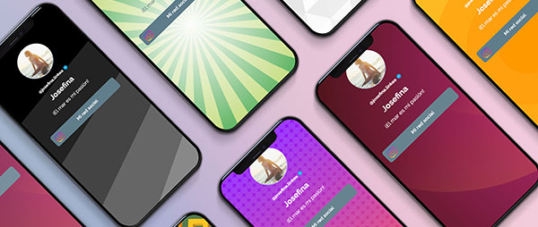

<p align="center">
  
</p>

<p align="center">
  <strong>Tu link en bio, potenciado.</strong>
</p>

<p align="center">
  
  
  
  
  
</p>

---

## Sobre Linkea

**Linkea** es una plataforma "link in bio" (similar a Linktree) que permite a usuarios crear landing pages personalizadas con todos sus enlaces importantes en un solo lugar.

## Stack Tecnologico

| Capa | Tecnologia |
|------|------------|
| Backend | Laravel 12 |
| Frontend | React 19 + TypeScript |
| Bridge | Inertia.js |
| Estilos | Tailwind CSS 4 |
| Base de datos | SQLite / MySQL |
| Autenticacion | Laravel Sanctum + Sessions |

## Instalacion

```bash
# Clonar repositorio
git clone https://github.com/tecnomanu/linkea-v2.git
cd linkea-v2

# Instalar dependencias
composer install
npm install

# Configurar entorno
cp .env.example .env
php artisan key:generate

# Migrar base de datos
php artisan migrate --seed

# Iniciar desarrollo
php artisan serve
npm run dev
```

## Estructura del Proyecto

```
app/
├── Http/Controllers/
│   ├── Panel/          # Vistas Inertia del panel
│   ├── Api/Panel/      # API endpoints (auto-save)
│   └── Auth/           # Autenticacion
├── Models/             # Landing, Link, User, Company
└── Services/           # Logica de negocio

resources/js/
├── Pages/              # Paginas Inertia
│   ├── Panel/          # Dashboard del usuario
│   ├── Auth/           # Login, Register
│   └── Web/            # Home publica
├── Components/         # Componentes React
│   ├── ui/             # Primitivos (Button, Dialog, etc.)
│   ├── Shared/         # Compartidos entre modulos
│   └── Panel/          # Especificos del panel
└── Layouts/            # Wrappers de layout
```

## Licencia

Proyecto privado - Todos los derechos reservados.
